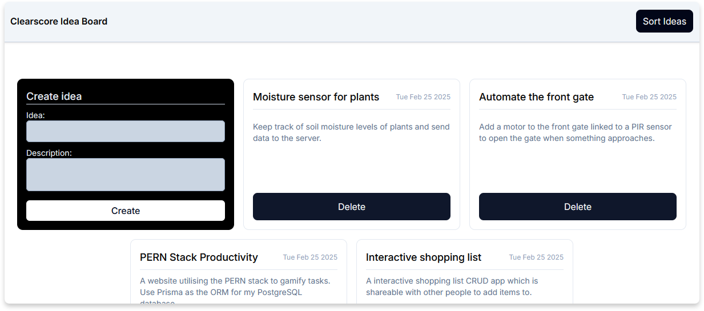

# ClearScore FED Test

A responsive tool to host and sort your ideas while data is persisted in local storage.

## Information

This test was provided by ClearScore for the Frontend Developer role. Both TailwindCSS and Shadcn have be utilised for styling and component usage for purely time based purposes.

**Required Features:**

- Fully responsive
- Title & description for each idea card
- Idea sorting (create date asc/desc & alphabetically asc/desc)

**Stretch Requirements:**

- Utilise `localStorage` to persist data.
- Character countdown when the character limit is approaching (140)
- Toast notification when cards are updated

## Installation & Commands

`npm i` - install dependencies (run this at the project root)

`npm run dev` - start the local development server

`npm run build` - generates the build directory which contains the product build of the application
