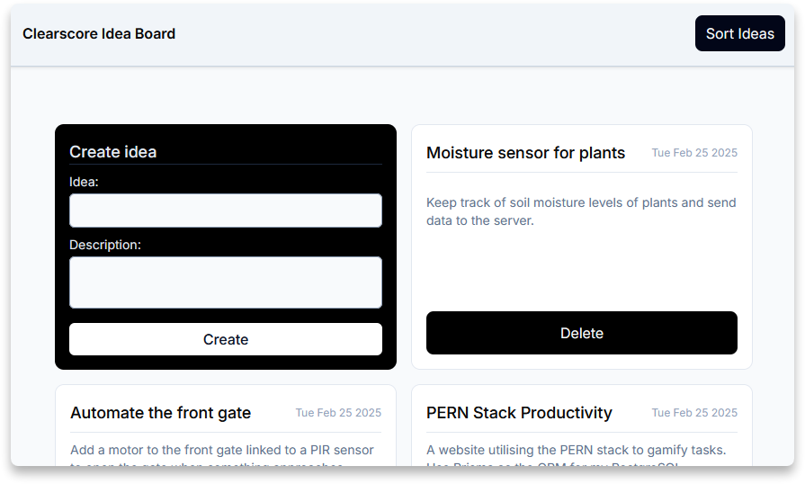

# ClearScore FED Test

A responsive tool to host and sort your ideas while data is persisted in local storage.

<h4 align="center">
    <a href="https://clearscore-idea-board.vercel.app" target="_blank">Demo</a>
</h4>

## Information

This test was provided by ClearScore for the Frontend Developer role. Both TailwindCSS and Shadcn have be utilised for styling and component usage for purely time based purposes.

**Required Features:**

- Fully responsive
- Title & description for each idea card
- Idea sorting (create date asc/desc & alphabetically asc/desc)
- Title field focused on page load and submission.

**Stretch Requirements:**

- Utilise `localStorage` to persist data.
- Character countdown when the character limit is approaching (140)
- Toast notification when cards are updated

## Reviewer Information

- Modal was originally used for creating ideas, however, this was removed for a better UX (reference: [modalzmodalzmodalz](https://modalzmodalzmodalz.com/)).
- `./src/components/ui` files can be ignored as they are from [Shadcn](https://ui.shadcn.com/).
- `type` used over `interface` for both consistency and the stricter nature of `type` due to having less features.

## Installation & Commands

`npm i` - install dependencies (run this at the project root)

`npm run dev` - start the local development server

`npm run build` - generates the build directory which contains the production build of the application
